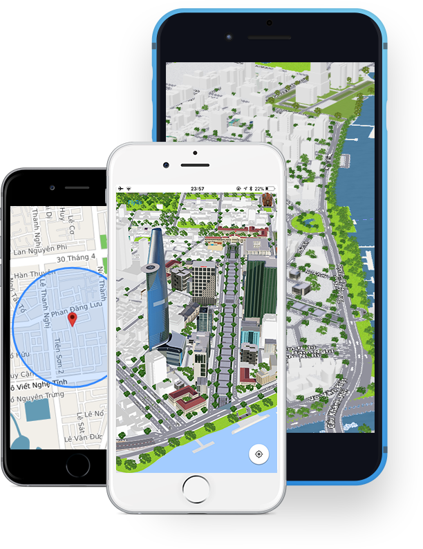

# Map4dMap Android SDK
[](https://map4d.vn/)
[](https://www.android.com/)
[](https://map4d.vn/)

Map4dMap Android SDK for Android, written in C/C++, Java.  

> Map4D Android SDK cho phép bạn tùy chỉnh bản đồ với nội dung để hiển thị trên thiết bị android hỗ trợ opengl 2.0   
Map4D Android SDK không chỉ mang hình ảnh thực tế lên trên bản đồ 3D, ngoài ra còn cho phép tương tác và điều chỉnh các đối tượng 3D của bạn  

[](https://map4d.vn) 

## Installation

Nếu dự án của bạn dùng Gradle thì trước hết cần khai báo url cho maven trong file gradle project.

```xml
allprojects {
    repositories {
        maven {
            url = "https://packages.map4d.vn/repository/maven-public"
        }
    }
}
```

Thêm vào dependencies:

```xml
dependencies {
  implementation 'vn.map4d:Map4dTypes:1.1.0'
  implementation 'vn.map4d:Map4dMap:2.0.0'
}
```

## Using

1. Provide access key

```xml
<?xml version="1.0" encoding="utf-8"?>
<manifest xmlns:android="http://schemas.android.com/apk/res/android"
  package="vn.map4d.simplemap">
  <application
    android:theme="@style/AppTheme">
    <meta-data
      android:name="vn.map4d.map.ACCESS_KEY"
      android:value="TYPE_YOUR_KEY_HERE"/>
  </application>
  <uses-permission android:name="android.permission.INTERNET" />
  <uses-permission android:name="android.permission.ACCESS_NETWORK_STATE" />
  <uses-permission android:name="android.permission.ACCESS_FINE_LOCATION" />
</manifest>

```

2. Create layout sử dụng MFMapView

```xml
<vn.map4d.map.core.MFMapView
  android:id="@+id/mapView"
  android:layout_width="wrap_content"
  android:layout_height="wrap_content"
/>
```
3. Working with map view (kotlin)

> **Chú ý:** <span style="color:red">Khi dùng MFMapView thì chúng ta cần override các phương thức lifecycle sau của Activity hoặc Fragment chứa nó và gọi tới
các hàm tương ứng của đối tượng MFMapView (như code ví dụ ở bên dưới).</span>
 
- **onCreate(Bundle)**
- **onDestroy()**
- **onSaveInstanceState(Bundle)**
- **onStart()** (Override phương thức này nếu sử dụng phiên bản SDK >= **2.0.11**)
- **onStop()** (Override phương thức này nếu sử dụng phiên bản SDK >= **2.0.11**)

<!-- tabs:start -->
#### ** Java **

```java
public class MainActivity extends AppCompatActivity implements OnMapReadyCallback{ 
    
    private MFMapView mapView;
    private Map4D map4D;
  
    @Override
    protected void onCreate(Bundle savedInstanceState) { 
        super.onCreate(savedInstanceState);
        setContentView(R.layout.simple3d_map_activity);
        mapView = findViewById(R.id.map3D);
        mapView.onCreate(savedInstanceState);
        mapView.getMapAsync(this); 
    }
  
    @Override
    public void onMapReady(Map4D map4D) { 
        map4D.enable3DMode(true);
        // Your code
    }
      
    @Override
    protected void onDestroy() { 
        mapView.onDestroy(); 
        super.onDestroy();
    }
    
    @Override
    protected void onSaveInstanceState(Bundle outState) {
        super.onSaveInstanceState(outState);
        mapView.onSaveInstanceState(outState);
    }
    
    // Override phương thức này nếu sử dụng phiên bản SDK >= 2.0.11
    @Override
    protected void onStart() {
        super.onStart();
        mapView.onStart();
    }

    // Override phương thức này nếu sử dụng phiên bản SDK >= 2.0.11
    @Override
    protected void onStop() {
        mapView.onStop();
        super.onStop();
    }
}
```

#### ** Kotlin **

```kotlin
import vn.map4d.map.core.Map4D
import vn.map4d.map.core.OnMapReadyCallback

class MainActivity : AppCompatActivity(), OnMapReadyCallback {

    private var map4D: Map4D? = null

    override fun onCreate(savedInstanceState: Bundle?) {
        super.onCreate(savedInstanceState)
        setContentView(R.layout.activity_main)
        mapView?.onCreate(savedInstanceState)
        mapView?.getMapAsync(this)
    }

    override fun onMapReady(map4D: Map4D?) {
        map4D?.enable3DMode(true)
        // Your code
    }
    
    override fun onDestroy() {
        mapView?.onDestroy()
        super.onDestroy()
    }
    
    override fun onSaveInstanceState(outState: Bundle) {
        super.onSaveInstanceState(outState)
        mapView?.onSaveInstanceState(outState)
    }

    // Override phương thức này nếu sử dụng phiên bản SDK >= 2.0.11
    override fun onStart() {
        super.onStart()
        mapView?.onStart()
    }

    // Override phương thức này nếu sử dụng phiên bản SDK >= 2.0.11
    override fun onStop() {
        mapView?.onStop()
        super.onStop()
    }
}
```
<!-- tabs:end -->
