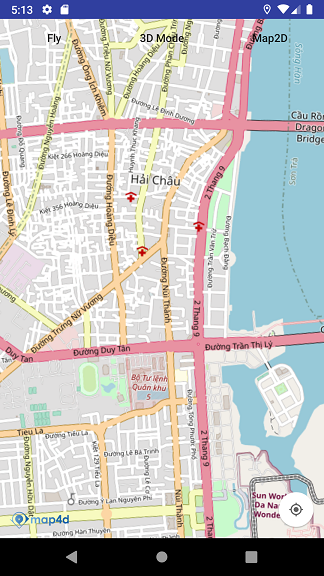

# Tile Overlay

**Tile Overlay** là một loại overlay cho phép người dùng hiển thị các tile map khác nhau từ nhiều nguồn khác nhau lên trên
tile map có sẵn của Map4D.



## Giới thiệu

Một đối tượng **TileOverlay** sẽ xác định một tập hợp các hình ảnh của tile sẽ được vẽ lên trên các tile của bản đồ Map4D.

Bạn cần phải cung cấp các tile cho từng mức zoom mà bạn muốn vẽ. Tile Overlay rất hữu ích khi bạn muốn thêm hình ảnh bao
quát vào bản đồ, thường bao gồm các khu vực địa lý rộng lớn, hoặc những hình ảnh chi tiết hơn cho một khu vực nào đó.

## Tile coordinates và các mức Zoom

Bản đồ Map4D chia hình ảnh hiển thị thông tin bản đồ thành một tập hợp các ô bản đồ hình vuông được sắp xếp theo dạng lưới.
Khi bản đồ di chuyển đến một vị trí mới hoặc thay đổi một mức zoom mới thì Map4D sẽ xác định những ô nào sẽ được vẽ và request
dữ liệu hình ảnh cho các ô đó.

Ô có tọa độ (0, 0) luôn ở góc Tây Bắc của bản đồ, với giá trị **x** tăng từ Tây sang Đông và giá trị **y** tăng từ Bắc xuống
Nam. Các ô sẽ có từng tọa độ bằng cách sử dụng tọa đô x, y từ điểm gốc đó.

Ở mức zoom 0, toàn bộ bản đồ được hiển thị trong một ô duy nhất. Ở một mức zoom thì sẽ tăng độ phóng đại lên hai lần. Vì vậy
ở mức zoom 1, bản đồ sẽ được hiển thị dưới dạng lưới ô vuông 2x2. Tương tự thì ở mức zoom 2 là lướt 4x4, mức zoom 3 là lưới
8x8, ...

Ví dụ: ở mức zoom 2, toàn bộ bản đồ sẽ được chia thành 16 ô. Mỗi ô sẽ tương ứng với một cặp x, y duy nhất kết hợp với mức
zoom:


Khi tạo hình ảnh cho Tile Overlay, bạn cần tạo một ảnh cho mỗi tile tại từng mức zoom mà bạn muốn vẽ. Map4D yêu cầu kích
thước ảnh là 256dp.

## Thêm Tile overlay

Cách đơn giản và phổ biến nhất để tạo Tile Overlay là cung cấp một URL trỏ đến hình ảnh của ô cần vẽ. Lớp **MFUrlPOIProvider**
là lớp con của **MFTileProvider** và là một phần triển khai của **MFTileOverlay** để cung cấp hình ảnh của tile dựa trên
một URL. Lớp này yêu cầu tất cả các hình ảnh phải có cùng kích thước.

Bạn sẽ cần phải implement phương thức `MFUrlTileProvider.getTileUrl(int x, int y, int zoom, boolean _3dMode)` với các tham
số là x, y, zoom và chế độ 3D của Map. Phương thức này sẽ trả về là một **String** chứa URL trỏ tới hình ảnh được sử dụng cho tile.
Phương thức này cũng có thể trả về `null` nếu không có hình ảnh cho tile ứng với TileCoordinate đó. Một URL có thể trỏ tới
một resource online.

Vậy để thêm một **Tile Overlay** vào Map thì trước hết bạn phải có các hình ảnh cho các tile được xác định với tọa độ x, y và mức
zoom tương ứng. Sau đó bạn thêm **Tile Overlay** vào Map như sau:

1. Tạo một đối tượng `MFUrlTileProvider` để cung cấp hình ảnh cho tile.
2. Override phương thức `getTileUrl()` để trả về URL của ảnh cho từng tile.
3. Cung cấp một đối tượng `MFTileOverlayOptions` với các tùy chọn:

    1. `tileProvider(MFTileProvider)` : truyền vào một đối tượng MFUrlTileProvider được tạo ở trên sử dụng cho Tile Overlay.

    2. `visible(boolean)` : cho phép Tile Overlay ẩn hay hiện sau khi add vào Map.

    3. `zIndex(double)` : xác định giá trị zIndex cho Tile Overlay.

4. Gọi `Map4D.addTileOverlay()` để thêm Tile Overlay vào Map.

<!-- tabs:start -->
#### ** Java **

```java
private Map4D map4D;

MFTileProvider tileProvider = new MFUrlTileProvider() {
    @Override
    public String getTileUrl(int x, int y, int zoom, boolean _3dMode) {
        if (_3dMode) {
            return null;
        }
        return "https://tile.openstreetmap.de/" + zoom + "/" + x + "/" + y + ".png";
    }
};

MFTileOverlay tileOverlay = map4D.addTileOverlay(new MFTileOverlayOptions().tileProvider(tileProvider));
```

#### ** Kotlin **

```kotlin
private lateinit var map4D: Map4D

var tileProvider: MFTileProvider = object : MFUrlTileProvider() {
    override fun getTileUrl(x: Int, y: Int, zoom: Int, _3dMode: Boolean): String? {
        return if (_3dMode) {
            null
        } else "https://tile.openstreetmap.de/$zoom/$x/$y.png"
    }
}

val tileOverlay = map4D.addTileOverlay(MFTileOverlayOptions().tileProvider(tileProvider))
```
<!-- tabs:end -->

## Remove Tile overlay

Bạn có thể xóa Tile Overlay ra khỏi Map với phương thức `MFTileOverlay.remove()`

<!-- tabs:start -->
#### ** Java **

```java
tileOverlay.remove()
```

#### ** Kotlin **

```kotlin
tileOverlay.remove()
```
<!-- tabs:end -->

### Thay đổi zIndex

Gọi phương thức `MFTileOverlay.setZIndex()` để thay đổi giá trị zIndex của Tile Overlay

<!-- tabs:start -->
#### ** Java **

```java
tileOverlay.setZIndex(9)
```

#### ** Kotlin **

```kotlin
tileOverlay.setZIndex(9)
```
<!-- tabs:end -->

### Ẩn/Hiện Tile Overlay

Gọi phương thức `MFTileOverlay.setVisible()` để ẩn/hiện Tile Overlay.
**Chú ý:** Mặc dù Tile Overlay không hiển thị nhưng quá trình tải các tile vẫn diễn ra.

<!-- tabs:start -->
#### ** Java **

```java
tileOverlay.setVisible(false)
```

#### ** Kotlin **

```kotlin
tileOverlay.setVisible(false)
```
<!-- tabs:end -->

### Thay đổi độ trong suốt của Tile Overlay

Để thay đổi độ trong suốt của tile, ta gọi phương thức `setOpacity(float)` cho đối tượng `MFTileOverlay`

Chú ý: opacity chỉ nhận giá trị trong khoảng 0 -> 1

<!-- tabs:start -->
#### ** Java **

```java
tileOverlay.setOpacity(0.5f)
```

#### ** Kotlin **

```kotlin
tileOverlay.opacity = 0.5f
```
<!-- tabs:end -->
