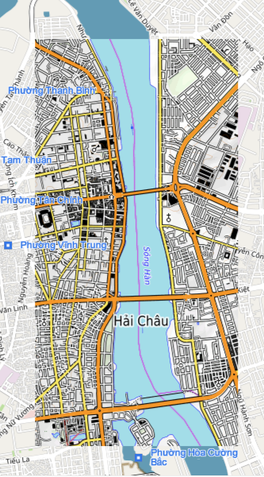

# Ground Overlay

Ground Overlay cho phép người dùng thực hiện việc thay thế tile ở một khu vực nào đó bằng tile từ những nguồn khác.  
Ground Overlay tương tự với Tile Overlay nhưng cho phép người dùng quy định 1 khu vực cụ thể gắn với kinh độ/vĩ độ, ngoài
ra còn cho phép người dùng loại bỏ việc hiển thị tile và các đối tượng thuộc tile của Map4dMap Android SDK.

Ground Overlay rất hữu ích khi bạn muốn sửa hình ảnh tại một số khu vực trên bản đồ.



## Add Ground Overlay

Để thêm 1 Ground Overlay vào map cần tạo một đối tượng `MFUrlGroundProvider`. Lớp **MFUrlGroundProvider** là lớp con của
lớp **MFTileProvider** và là một phần triển khai của **MFGroundOverlay** để cung cấp hình ảnh của các tile cần thiết dựa
trên một URL.

Bạn sẽ cần phải implement phương thức `MFUrlGroundProvider.getGroundUrl(int x, int y, int zoom, boolean _3dMode)` với các tham
số là x, y, zoom và chế độ 3D của Map. Phương thức này sẽ trả về là một **String** chứa URL trỏ tới hình ảnh được sử dụng cho tile.
Phương thức này cũng có thể trả về `null` nếu không có hình ảnh cho tile ứng với TileCoordinate đó. Một URL có thể trỏ tới
một resource online.

Vậy để thêm một **Ground Overlay** vào Map thì trước hết bạn phải có các hình ảnh cho các tile được xác định với tọa độ x, y và mức
zoom tương ứng. Sau đó bạn thêm **Ground Overlay** vào Map như sau:

1. Tạo một đối tượng `MFUrlGroundProvider` để cung cấp hình ảnh cho các tile cần vẽ.
2. Override phương thức `getGroundUrl()` để trả về URL của ảnh cho từng tile tương ứng.
3. Cung cấp một đối tượng `MFGroundOverlayOptions` với các tùy chọn:

    1. `groundProvider(MFTileProvider)` : truyền vào một đối tượng MFUrlGroundProvider được tạo ở trên sử dụng cho Ground Overlay.
    
    2. `mapUrl` : truyền vào đường dẫn URL hình ảnh của tile cho Ground Overlay tương tự như `groundProvider`, nó đơn giản hơn
        và không linh hoạt bằng `groundProvider` nếu chúng ta muốn xử lý nâng cao cho giá trị URL trả về. Nếu có cả hai option
        `groundProvider` và `mapUrl` thì sẽ ưu tiên lấy `mapUrl`. Vì vậy chúng ta nên chọn một trong hai options này.
    
    3. `bounds(MFCoordinateBounds)` : xác định vùng giới hạn để vẽ các hình ảnh tile của Ground Overlay. 
    
    4. `override(boolean)` : quy định các tile của Ground Overlay có thay thế cho các tile của Map4D hay không.

    5. `visible(boolean)` : cho phép Ground Overlay ẩn hay hiện sau khi add vào Map.

    6. `zIndex(double)` : xác định giá trị zIndex cho Ground Overlay.

4. Gọi `Map4D.addGroundOverlay()` để thêm Ground Overlay vào Map.

<!-- tabs:start -->
#### ** Java **

```java
private Map4D map4D;

MFGroundProvider groundProvider = new MFUrlGroundProvider() {
    @Override
    public String getGroundUrl(int x, int y, int zoom, boolean _3dMode) {
        if (_3dMode) {
            return null;
        }
        return "https://tile.openstreetmap.de/" + zoom + "/" + x + "/" + y + ".png";
    }
};

MFGroundOverlay groundOverlay = map4D.addGroundOverlay(
    new MFGroundOverlayOptions()
        .bounds(new MFCoordinateBounds(
            new MFLocationCoordinate(16.057814922971613, 108.22065353393553),
            new MFLocationCoordinate(16.064289641988594, 108.2324981689453)))
        .groundProvider(groundProvider));
```

#### ** Kotlin **

```kotlin
private lateinit var map4D: Map4D

var groundProvider: MFGroundProvider = object : MFUrlGroundProvider() {
    override fun getGroundUrl(x: Int, y: Int, zoom: Int, _3dMode: Boolean): String? {
        return if (_3dMode) {
            null
        } else "https://tile.openstreetmap.de/$zoom/$x/$y.png"
    }
}

val groundOverlay = map4D.addGroundOverlay(
    MFGroundOverlayOptions()
        .bounds(MFCoordinateBounds(
            MFLocationCoordinate(16.057814922971613, 108.22065353393553),
            MFLocationCoordinate(16.064289641988594, 108.2324981689453)))
        .groundProvider(groundProvider))
```
<!-- tabs:end -->

### Remove Ground Overlay

Bạn có thể xóa Ground Overlay ra khỏi Map với phương thức `MFGroundOverlay.remove()`

<!-- tabs:start -->
#### ** Java **

```java
groundOverlay.remove()
```

#### ** Kotlin **

```kotlin
groundOverlay.remove()
```
<!-- tabs:end -->

### Thay đổi zIndex

Gọi phương thức `MFGroundOverlay.setZIndex()` để thay đổi giá trị zIndex của Ground Overlay

<!-- tabs:start -->
#### ** Java **

```java
groundOverlay.setZIndex(9)
```

#### ** Kotlin **

```kotlin
groundOverlay.setZIndex(9)
```
<!-- tabs:end -->

### Ẩn/Hiện Ground Overlay

Gọi phương thức `MFGroundOverlay.setVisible()` để ẩn/hiện Ground Overlay.  
**Chú ý:**
- Mặc dù Ground Overlay không hiển thị nhưng quá trình tải các tile vẫn diễn ra khi kéo map đến khu vực quy định cho Ground Overlay.
- Trong trường hợp set `override` là `true` nhưng lại `visible` là `false` thì ground không được hiển thị và khu vực đó cũng không thể hiển thị dữ liệu của Map4D.

<!-- tabs:start -->
#### ** Java **

```java
groundOverlay.setVisible(false)
```

#### ** Kotlin **

```kotlin
groundOverlay.setVisible(false)
```
<!-- tabs:end -->

### Thay đổi độ trong suốt của Ground Overlay

Để thay đổi độ trong suốt của tile, ta gọi phương thức `setOpacity(float)` cho đối tượng `MFGroundOverlay`

Chú ý: opacity chỉ nhận giá trị trong khoảng 0 -> 1

<!-- tabs:start -->
#### ** Java **

```java
groundOverlay.setOpacity(0.5f)
```

#### ** Kotlin **

```kotlin
groundOverlay.opacity = 0.5f
```
<!-- tabs:end -->

