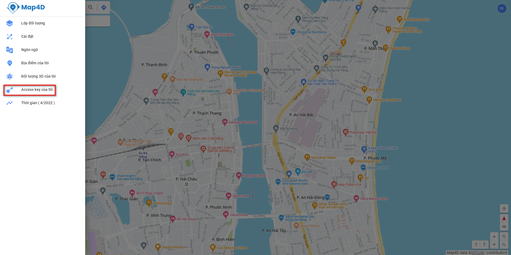
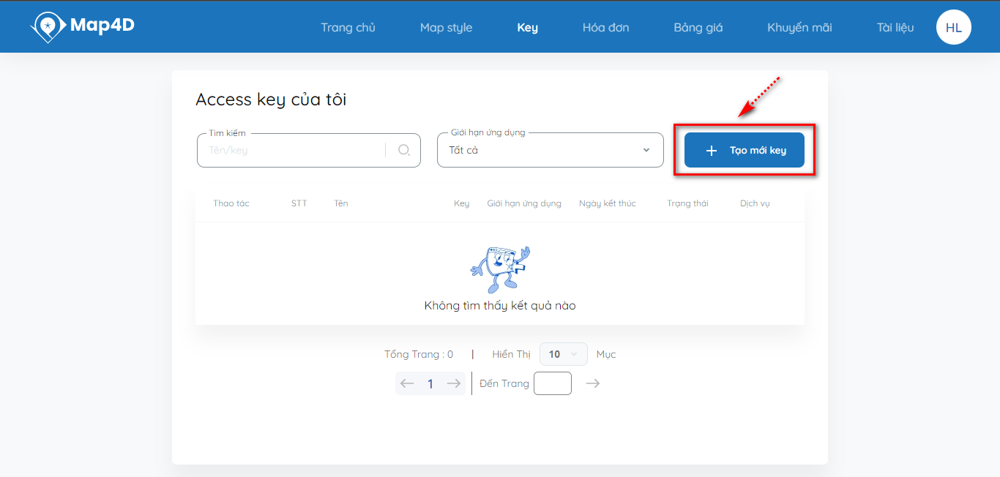

# Map4dService API

Map4D API Service cung cấp nền tảng cho Web, iOS, Android,

Để sử dụng được các API này thì yêu cầu phải có key 
Đăng nhập hoặc đăng kí vào Map4D để tạo và quản lý key [tại đây](https://map.map4d.vn/)

## 1. Tạo và quản lý key trên Map4D
**B1:** Chọn vào nút chức năng "Đăng nhập"  ngay trên góc phải màn hình chính của bản đồ Map4D để đăng nhập

Nếu chưa có tài khoản, chọn “Đăng ký tài khoản” để vào chức năng đăng ký tài khoản người dùng hoặc đăng ký tài khoản bằng cách login và tài khoản Google/Apple ID/Facebook

**B2:** Sau khi đăng nhập thành công vào Map4D, bấm vào nút "Menu"  ở góc trái màn hình bên cạnh ô “Tìm kiếm” tại màn hình chính Map4D để mở bảng Menu  

**B3:** Trên Menu chức năng, chọn "Access key của tôi" tại màn hình Map4D User để vào chức năng quản lý tất cả các Access key. Trường hợp user mới và chưa có key nào được tạo, bảng Access key của tôi sẽ trống

**B4:** Chọn nút lệnh  ngay trên góc phải màn hình danh sách Access key của tôi để gọi chức năng tạo mới một key

**Nhập các thông tin key của tôi:**
 - Tên: Là tên key (Tên gợi nhớ vào mục đích sử dụng riêng của user)
 - Ngày kết thúc: Ngày cuối cùng key có thể sử dụng được trên hệ thống map4D. Trường hợp không chọn ngày, key sẽ hết hạn khi đạt mức request tối đa cho phép.
 - Loại dịch vụ: Là loại dịch vụ cho phép key người dùng sử dụng. Có thể chọn một hoặc nhiều loại dịch vụ cùng lúc:

    Địa điểm: Cho phép key có quyền sử dụng các dịch vụ nhóm loại dịch vụ địa điểm

    Bản đồ: Cho phép key có quyền truy cập các dịch vụ nhóm loại dịch vụ bản đồ

    Tìm đường: Cho phép key có quyền truy cập nhóm dịch vụ tuyến đường

- Chế độ: Là môi trường cho phép sử dụng key của người dùng, Map4D hỗ trợ các môi trường chính: Development, Apple Store/Google Play Store và không xác định.
- Giới hạn ứng dụng: Là các hạn chế ứng dụng: kiểm soát các trang web, địa chỉ Ips, …
    Không giới hạn

    AndroidApps: Giới hạn bởi danh sách PackageId đã đăng ký khi tạo key

    HttpReferrers: Giới hạn bởi danh sách domain mà user đăng ký khi tạo key

    IPs: Giới hạn bới danh sách địa chỉ IP mà user đăng ký khi tạo key

    IosApps: Giới hạn bởi danh sách BundleId đã đăng ký khi tạo key
**B5:** Chọn vào nút chức năng “Lưu” key khi đã hoàn thành các thông tin cần thiết. Hệ thống tự động trở về màn hình danh sách Access key của tôi.

## 2. Danh sách API
1. Tìm đường đi giữa các địa điểm [Route](api_route.md)
2. Tự động đề xuất chuỗi tìm kiếm [AutoSuggest](api_autosuggest.md)
3. Tìm kiếm dạng văn bản [TextSearch](api_text_search.md)
4. Tìm kiếm lân cận [NearbySearch](api_nearby_search.md)
5. Tìm kiếm trong hộp chữ nhật [ViewboxSearch](api_viewbox_search.md)

## Call API
API có thể được gọi bằng đường dẫn

`
https://api.map4d.vn/sdk/map/{API_FUNCTION}?{PARAMETER1}={VALUE1}&{PARAMETER2}={VALUE2}&{PARAMETER(n)}={VALUE(n)}&key=`[{Your_Api_Key}](https://map.map4d.vn/user/access-key/add) 

Trong đó:
- **API_FUNCTION**: là tên hàm muốn gọi
- **PARAMETER1, PARAMETER2, PARAMETER(n)**: là tham số truyền vào tương ứng với API_FUNCTION
- **VALUE1, VALUE2, PARAMETER(n)**: là giá trị truyền vào cho từng tham số tương ứng
- **YOUR_API_KEY**: là key - một mã định danh để xác thực các yêu cầu liên quan đến projects dùng trong việc sử dụng và thanh toán (Đăng nhập và đăng ký key [tại đây](https://map.map4d.vn/user/access-key/add))
